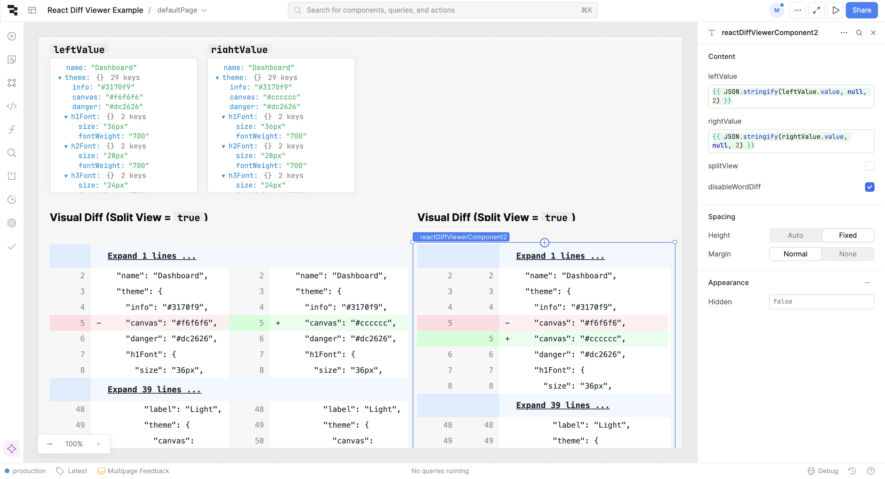

## Retool Custom Component for [`react-diff-viewer-continued`](https://www.npmjs.com/package/react-diff-viewer-continued)

This repo is based off of [tryretool/custom-component-collection-template](https://github.com/tryretool/custom-component-collection-template) and has been modified to contain a minimal example for creating a Retool Custom Component from an existing React component -- in this case, [`react-diff-viewer-continued`](https://www.npmjs.com/package/react-diff-viewer-continued)

To learn more about how custom component libraries work, visit [Retool's official documentation on Custom Component Libraries](https://docs.retool.com/apps/guides/custom/custom-component-libraries).

### Screenshot
The screenshot below shows an example app that visualizes the diff of two Javascript objects in both splitView=true and splitView=false modes.

### Quick Start
Use these commands to install this Custom Component library into your Retool instance. For more complete instructions, visit [Retool's official documentation on Custom Component Libraries](https://docs.retool.com/apps/guides/custom/custom-component-libraries).

1. Clone this repo and enter the directory
2. Run `npm install` 
3. Run `npx retool-ccl login` to login to your Retool instance. You will be guided to create an API key that allows read/write access to Custom Component Libraries.
4. Run `npx retool-ccl init` to initialize a new Custom Component Library in your Retool instance
5. Run `npx retool-ccl dev` to test this Custom Component in dev mode
6. Run `npx retool-ccl deploy` to deploy this Custom Component to your Retool instance

